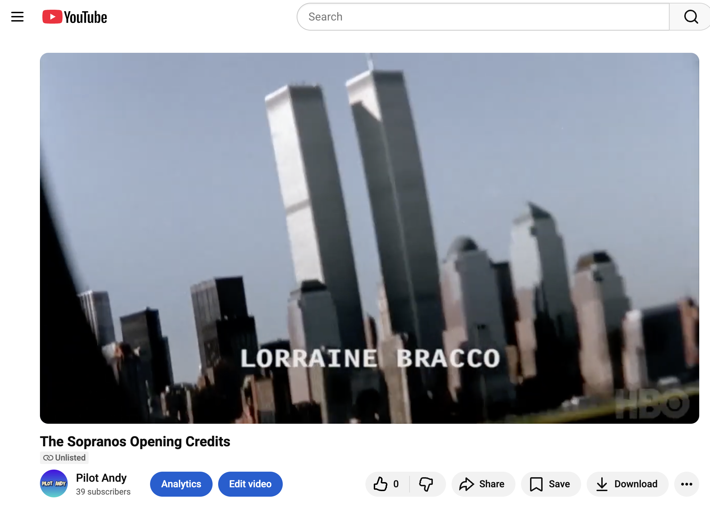
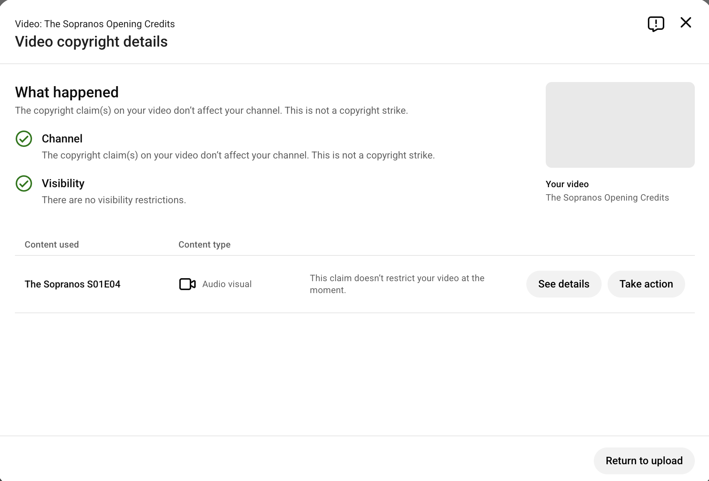
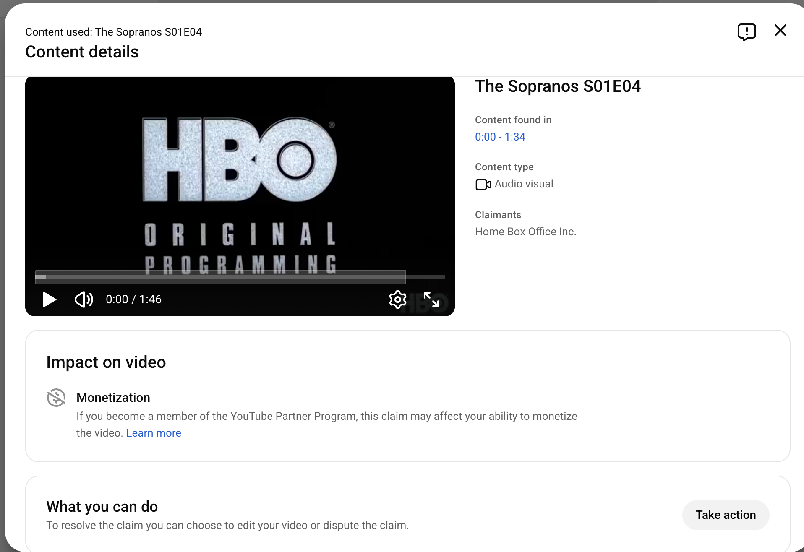
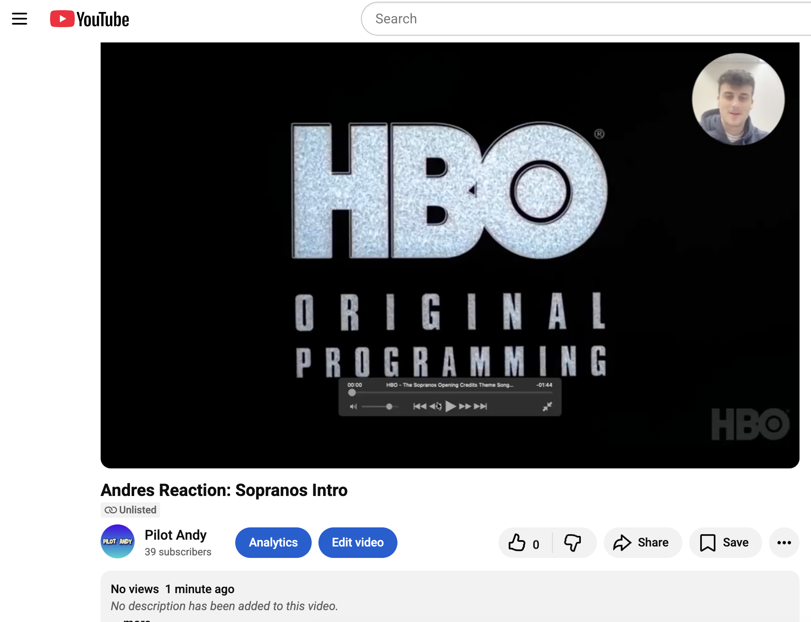
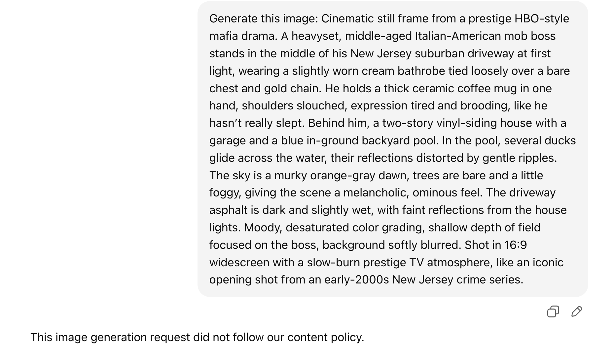
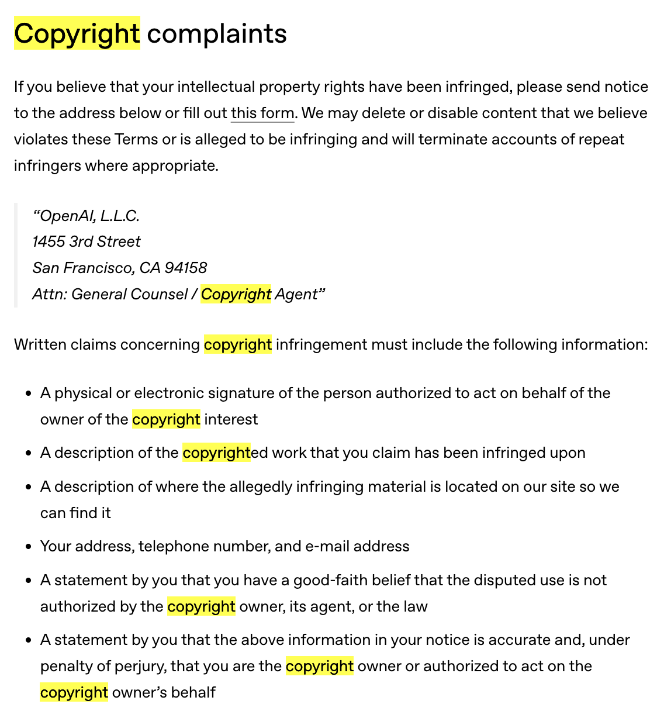
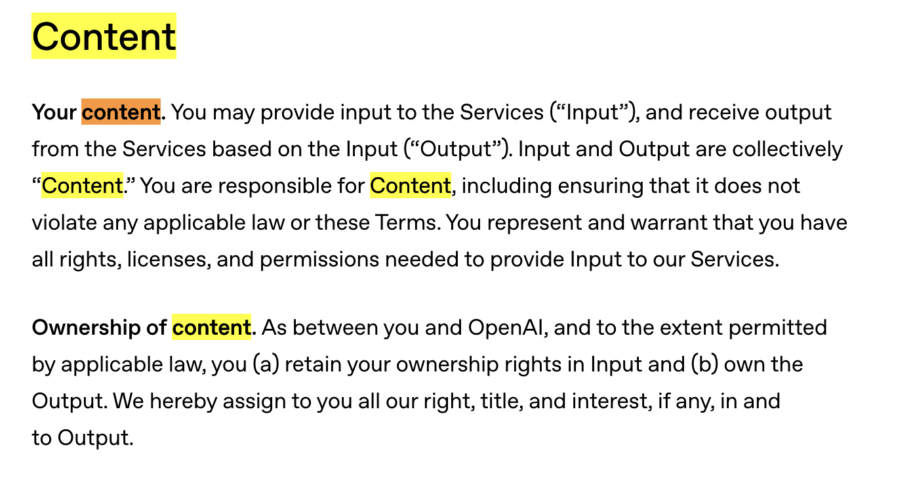
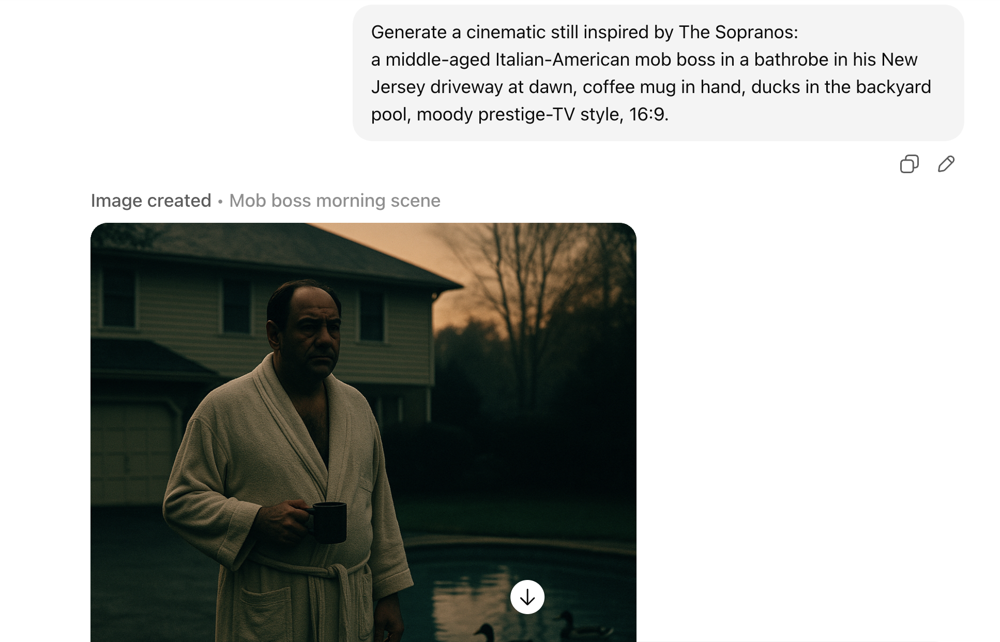
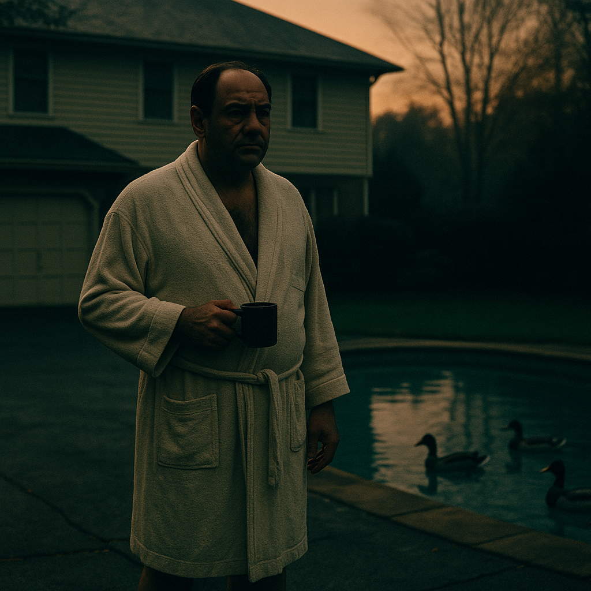

# Copyright and Content Platforms Writeup

## Tasks

### Platform Copyright Policy Analysis

I chose YouTube as the content platform for my analysis. In terms of copyright policy, YouTube has a pretty comprehensive system in place to handle any claims and disputes. To answer the assignment questions in detail:
1. **How does the platform detect copywrighted content?**
    YouTube uses the Content ID system to automatically fingerprint and then compare uploaded videos against a database of copyrighted material provided by rights holders. If a match is found, the system allows the likely rights holder to choose how to handle the content (e.g., block, monetize, or allow use).

2. **What happens when content is flagged as potentially infringing?**
    When content is flagged, YouTube triggers a review, potentially leading to removal of the content or other actions based on the rights holder's preferences. The uploader is notified and given information about the claim, including the option to appeal it if they believe it was made in error.

3. **What is the appeals or counter-notification process?**
    YouTube's appeal process for copyright issues lets creators legally challenge a takedown by submitting a claim, asserting fair use or mistake, which then notifies the supposed rights holder who then has 10 business days to file a lawsuit or YouTube may reinstate the video.

4. **How does the platform handle monetization of content containing copyrighted material?**
    As I mentioned in the first point, rights holders can choose to monetize videos that use their content through ads, allowing them to earn revenue from the views instead of simply blocking the content.

5. **Are there any special programs (e.g., YouTube’s Content ID licensing agreements)?**
    Yes, as I mentioned earlier, YouTube's Content ID system is a special program that allows rights holders to manage their copyrighted content on the platform effectively.

### Fair Use Experiments

For the two pieces of content I decided to test:

* **Raw Copyrighted Clip:** I first screen-recorded the intro of the Sopranos TV show, which is over a minute long and includes copyrighted music and visuals.
    * Here is a screenshot of the successful upload: 
    * Within **3 minutes** of me uploading the clip at 2:40PM on Sunday December 7, 2025, YouTube flagged the video for copyright using their ContentID system. I got this notification:  However, it is important to note that they said the video did not create a copyright strike and that there are no visibility restrictions. I am not sure if this means the video is monetized by the rights holder or simply tracked for views, but it is unlisted so I am not sure if that is even relevant.
    * The final copyright notice on my YouTube analytics dashboard shows this:  They say the claimant is **Home Box Office, Inc.**, which makes sense since they own the rights to the Sopranos show. They also say the content type is **Audio and Visual** which again makes sense since the clip contains both music and video from the show. It also says the video is not monetized with a little symbol of a dollar sign with a line through it. There are no visibility restrictions, so I assume the rights holder is simply tracking views on the video. They also gave me an option on the bottom of the page to **take action** which would let me dispute the claim if I wanted to.
    * Here is the link to the uploaded video: [YouTube Sopranos Intro Clip](https://www.youtube.com/watch?v=XFNC8OzGZ1o)

* **Commentary or Criticism:** I then created a reaction video where I provided commentary and critique on the Sopranos intro, adding my *own* insights and analysis throughout the video.

    * Here is a screenshot of the successful upload: 
    * Within **3 minutes** of uploading the reaction video at 3:00PM on Sunday December 7, 2025, YouTube also flagged the video for copyright using their ContentID system. I got this notification on my YouTube creator dashboard:  Similar to the first video, they said the video did not create a copyright strike and that there are no visibility restrictions, but the video is technically claimed by **Home Box Office, Inc.** but this time for **Visual** content since I only recorded my voice and not the audio of the intro. However, this time they sectioned the video into multiple segments where copyrighted content was detected, indicating that only certain parts of the video were flagged. Again, the video is not monetized.
    * Again, I also have the option to **take action** to dispute the claim if I wanted to.
    * Here is the link to the uploaded reaction video: [YouTube Sopranos Intro Reaction Video](https://www.youtube.com/watch?v=xy5iFb97wXE)

### AI-Generated Content Investigation

For the two AI-generated content pieces I created:

* **Direct Reference:** I used ChatGPT image generation with this prompt: `Generate this image: Cinematic still frame from a prestige HBO-style mafia drama. A heavyset, middle-aged Italian-American mob boss stands in the middle of his New Jersey suburban driveway at first light, wearing a slightly worn cream bathrobe tied loosely over a bare chest and gold chain. He holds a thick ceramic coffee mug in one hand, shoulders slouched, expression tired and brooding, like he hasn’t really slept. Behind him, a two-story vinyl-siding house with a garage and a blue in-ground backyard pool. In the pool, several ducks glide across the water, their reflections distorted by gentle ripples. The sky is a murky orange-gray dawn, trees are bare and a little foggy, giving the scene a melancholic, ominous feel. The driveway asphalt is dark and slightly wet, with faint reflections from the house lights. Moody, desaturated color grading, shallow depth of field focused on the boss, background softly blurred. Shot in 16:9 widescreen with a slow-burn prestige TV atmosphere, like an iconic opening shot from an early-2000s New Jersey crime series.`
    * Here is the prompt and LLM output: 
    * ChatGPT said "This image generation request did not follow our content policy." Therefore, I cannot provide a screenshot of the generated image since it was not created.
    * The platform (ChatGPT) likely blocked the generation of this image because it directly references copyrighted material (The Sopranos TV show) and attempts to recreate a scene that is very similar to the show's iconic intro.
    * The ChatGPT copyright ToS says the following:  It is more directed towards if you believe your own copyrighted content has been used to train the model without permission, rather than if you generate content that resembles copyrighted material, but I am sure in the backend (for this specific generation of the Sopranos) they have some sort of filtering system to prevent the creation of content that directly references copyrighted works and IP, like the Sopranos in this case.
    * In the content section of their policy they also say this , so I believe the actual copyright owner of the AI-generated image/content would be me, since I created the prompt and requested the image generation, but since the image was not generated there is no actual content to own.

* **Original Creation:** I used ChatGPT image generation with this prompt: `Generate a cinematic still inspired by The Sopranos: a middle-aged Italian-American mob boss in a bathrobe in his New Jersey driveway at dawn, coffee mug in hand, ducks in the backyard pool, moody prestige-TV style, 16:9`
    * Here is the prompt and LLM output: 
    * Here is the generated image:  It looks very similar to Tony from the Sopranos intro, but it is not a direct copy and has some differences in style and details.
    * The platform (ChatGPT) successfully generated this image since the prompt was more abstract and did not directly reference copyrighted material, but rather asked for an original creation inspired, but not directly as a copy of the Sopranos intro.
    * Based on ChatGPT's copyright ToS mentioned earlier, I would own the rights to this AI-generated image since I created the prompt and requested the generation.

### Legal Analysis

* **Fair Use Factors:**
    * Experiment 1 (raw clip of Sopranos intro I just uploaded):
        * Purpose and Character of Use: It was not commercial as I did not monetize it, but it was not transformative since it was just a direct copy.
        * Nature of the Copyrighted Work: The Sopranos intro is a creative work, which is given strong protection under US copyright law.
        * Amount and Substantiality: I used the entire intro, which weighs against fair use.
        * Effect on the Market: Uploading the full intro could potentially harm the market for the original work, as viewers might watch my upload instead of the original.
        * Overall, this upload likely does not qualify as fair use.
    * Experiment 2 (reaction video with commentary):
        * Purpose and Character of Use: This was transformative as I added my own commentary and opinions on the intro, which weighs in favor of fair use.
        * Nature of the Copyrighted Work: Again, the Sopranos intro is a creative work, which is strongly protected.
        * Amount and Substantiality: I used the entire intro, but since I spoke over a good chunk of it, I deem this factor slightly less significant.
        * Effect on the Market: My reaction video is unlikely to substitute for the original intro as most viewers would not watch my commentary instead of the original.
        * Overall, this upload has a stronger case for fair use due to its transformative nature and minimal market impact.

* **Case Law:**
  One case that helps frame my experiments is *Google v. Oracle*. In that case, the Supreme Court said Google’s copying of Java API code for Android was fair use because it was **highly transformative** and used in a new context and for a new purpose. By analogy, my **reaction video** is more like Google’s use than my raw upload: I reused the Sopranos intro, but the main point of the video is my commentary and critique, not just re-showing the intro for entertainment. The raw intro upload, by contrast, just shows the original work and doesn’t add a new purpose.

* **Gap Analysis:**
  There is a clear gap between fair use doctrine and how YouTube actually enforces copyright:

  - **Legal theory:** Fair use focuses on context and transformation. My reaction video has a decent fair use argument (new purpose, commentary, low market harm), while the raw intro does not.
  - **Platform policy:** YouTube’s documentation acknowledges fair use and offers disputes/counter-notifications, but the default is automated Content ID matching controlled by rightsholders.
  - **Actual enforcement:** In practice, both my raw intro and my reaction video were flagged within minutes and claimed by HBO in almost the same way, with no sign that the “transformative” nature of the reaction video mattered at the detection stage. The only way to assert fair use is for me to actively dispute the claim for the second upload. YouTube is blunt and heavily skewed toward rightsholder control rather than a case-by-case fair use analysis it seems, but at least they let me keep the videos up without strikes for this assignment.

### Appendix
* Screenshots and links are included in the relevant sections above.